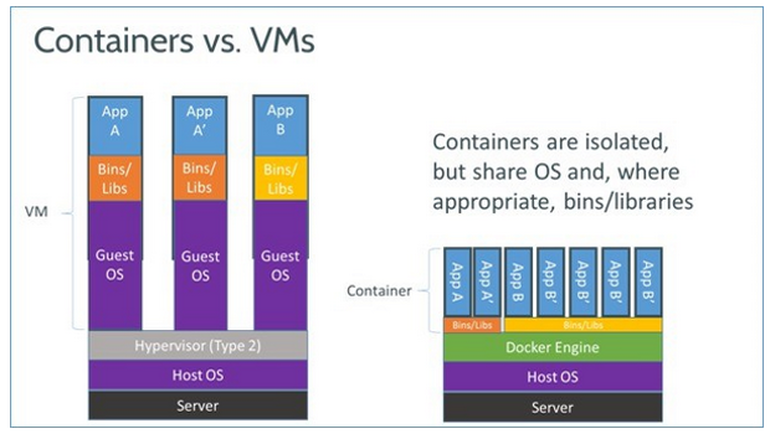

# Docker do Zero ao Deploy

## Diferença de containers vs máquinas virtuais (VMs)

A principal diferença entre containers Docker e máquinas virtuais (VMs). Ambos os métodos são utilizados para empacotar e executar aplicativos, mas o fazem de maneiras distintas.

#### Containers Docker:

- Leves: Os containers Docker são mais leves que as VMs, pois não emulam um sistema operacional completo. Em vez disso, eles compartilham o kernel do sistema operacional host e empacotam apenas os componentes específicos necessários para executar o aplicativo.
  Portáteis: A portabilidade é uma das principais vantagens dos containers Docker. Eles podem ser executados em qualquer ambiente que tenha o Docker Engine instalado, independentemente do sistema operacional subjacente.
- Isoláveis: Cada container Docker é executado em um ambiente isolado, o que significa que não interfere em outros containers ou no sistema operacional host. Isso torna os containers Docker ideais para ambientes multi-inquilino e para testar aplicativos em diferentes ambientes.
- Eficientes: Os containers Docker são mais eficientes que as VMs em termos de uso de recursos. Eles exigem menos CPU, memória e armazenamento, o que os torna ideais para ambientes com recursos limitados.

#### Máquinas Virtuais (VMs):

- Isolamento completo: As VMs fornecem um isolamento completo do sistema operacional, o que significa que cada VM tem seu próprio kernel, bibliotecas e aplicativos. Isso pode ser útil para executar aplicativos que exigem um ambiente específico ou para isolar aplicativos sensíveis.
- Flexibilidade: As VMs oferecem mais flexibilidade do que os containers Docker, pois podem ser configuradas com diferentes sistemas operacionais e softwares. Isso pode ser útil para executar aplicativos que não são compatíveis com o Docker ou para ambientes que exigem configurações específicas.
- Desempenho: As VMs geralmente têm melhor desempenho do que os containers Docker, pois possuem seus próprios recursos dedicados. Isso pode ser importante para aplicativos que exigem alto desempenho.

##### Qual tecnologia usar:

A melhor tecnologia para você dependerá de suas necessidades específicas. Se você precisa de uma solução leve, portátil e eficiente, os containers Docker são uma boa opção. Se você precisa de isolamento completo, flexibilidade ou melhor desempenho, as VMs podem ser uma opção melhor.

##### Foco na Imagem:

A imagem destaca os seguintes pontos importantes sobre o Docker:

- Os containers Docker são executados em um ambiente isolado, representado pelas caixas separadas na imagem.
- Os containers Docker compartilham o kernel do sistema operacional host, representado pela base comum na imagem.
- Os containers Docker são mais leves que as VMs, pois não emulam um sistema operacional completo.
- Os containers Docker são portáteis e podem ser executados em qualquer ambiente que tenha o Docker Engine instalado.
