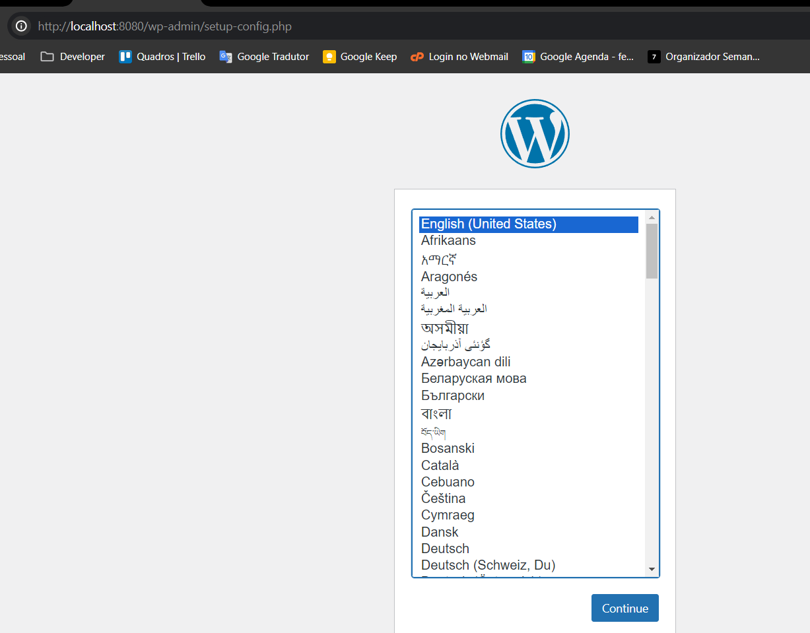
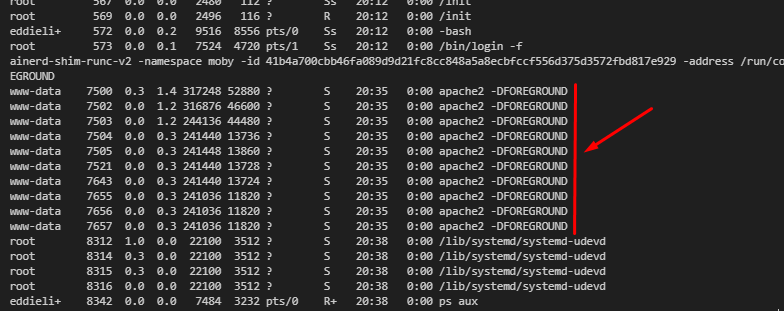
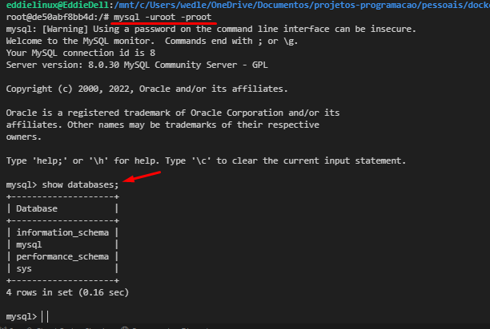
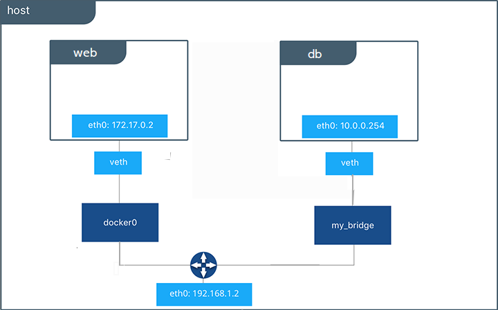

# Docker do Zero ao Deploy

## Diferença de containers vs máquinas virtuais (VMs)

A principal diferença entre containers Docker e máquinas virtuais (VMs). Ambos os métodos são utilizados para empacotar e executar aplicativos, mas o fazem de maneiras distintas.


#### Containers Docker:

- Leves: Os containers Docker são mais leves que as VMs, pois não emulam um sistema operacional completo. Em vez disso, eles compartilham o kernel do sistema operacional host e empacotam apenas os componentes específicos necessários para executar o aplicativo.
  Portáteis: A portabilidade é uma das principais vantagens dos containers Docker. Eles podem ser executados em qualquer ambiente que tenha o Docker Engine instalado, independentemente do sistema operacional subjacente.
- Isoláveis: Cada container Docker é executado em um ambiente isolado, o que significa que não interfere em outros containers ou no sistema operacional host. Isso torna os containers Docker ideais para ambientes multi-inquilino e para testar aplicativos em diferentes ambientes.
- Eficientes: Os containers Docker são mais eficientes que as VMs em termos de uso de recursos. Eles exigem menos CPU, memória e armazenamento, o que os torna ideais para ambientes com recursos limitados.

#### Máquinas Virtuais (VMs):

- Isolamento completo: As VMs fornecem um isolamento completo do sistema operacional, o que significa que cada VM tem seu próprio kernel, bibliotecas e aplicativos. Isso pode ser útil para executar aplicativos que exigem um ambiente específico ou para isolar aplicativos sensíveis.
- Flexibilidade: As VMs oferecem mais flexibilidade do que os containers Docker, pois podem ser configuradas com diferentes sistemas operacionais e softwares. Isso pode ser útil para executar aplicativos que não são compatíveis com o Docker ou para ambientes que exigem configurações específicas.
- Desempenho: As VMs geralmente têm melhor desempenho do que os containers Docker, pois possuem seus próprios recursos dedicados. Isso pode ser importante para aplicativos que exigem alto desempenho.

##### Qual tecnologia usar:

A melhor tecnologia para você dependerá de suas necessidades específicas. Se você precisa de uma solução leve, portátil e eficiente, os containers Docker são uma boa opção. Se você precisa de isolamento completo, flexibilidade ou melhor desempenho, as VMs podem ser uma opção melhor.

##### Foco na Imagem:

A imagem destaca os seguintes pontos importantes sobre o Docker:

- Os containers Docker são executados em um ambiente isolado, representado pelas caixas separadas na imagem.
- Os containers Docker compartilham o kernel do sistema operacional host, representado pela base comum na imagem.
- Os containers Docker são mais leves que as VMs, pois não emulam um sistema operacional completo.
- Os containers Docker são portáteis e podem ser executados em qualquer ambiente que tenha o Docker Engine instalado.

## OBJETIVO PRÁTICO

Implementar uma aplicação do workpress com mysql com docker

#### wordpress - php

Escolher versão da Imagem do wordpress
https://hub.docker.com/_/wordpress/tags

Executando container isolado possui seu próprio sistema de arquivos, sua própria rede e sua própria árvore de processos isolada, separada do host(isolado da minha maquina)

```
docker run [OPTIONS] IMAGE[:TAG|@DIGEST] [COMMAND] [ARG...]
```

Referência da imagem é o nome e a versão da imagem wordpress

```
docker run wordpress:php8.3-fpm-alpine
```

Mostrar contêineres em execução e parados (-a, --all)

```
docker ps -a
```

##### Container - efemero: Efêmero é um termo de origem grega (em que "ephémeros" significa "apenas por um dia") usado para designar uma situação que dura muito pouco tempo.

Parar contêiner docker

```
docker stop my_container
```

Mapeamento de portas
Para realizar o mapeamento de portas basta saber qual porta será mapeada no host e qual deve receber essa conexão dentro do container.

- -p 8080:80 mapeia a porta 80 do container para a porta 8080 do host

```
docker run -p "<host>:<container>"
```

Não foi possivel acessar a porta com a versão "php8.3-fpm-alpine", alteramos para a versão "6.5.4-php8.3-apache"

```
docker run -p 8080:80 wordpress:6.5.4-php8.3-apache
```

Possivel acessar conteiner http://localhost:8080/



Para informar os detalhes de conexão do banco de dados. Vamos rodar container do banco de dados em mysql para concluir a configuração do wordpress

##### Comando ps no Linux (visualiza processos)

Saber quais são os processos que mais consomem a CPU:

```linux
ps aux
```

Processos do container, rodando na minha maquina, reusando compartilhando os recursos do meu sistema operacional, mais leve do que a virtualização.



#### Banco de dados - mysql

Escolher versão da Imagem do mysql
https://hub.docker.com/_/mysql/tags

Referência da imagem é o nome e a versão da imagem mysql

```
docker run mysql:8.0.30-debian
```

O banco de dados não foi inicializado e a opção de senha não foi especificada
Você precisa especificar um dos seguintes:
-MYSQL_ROOT_PASSWORD
-MYSQL_ALLOW_EMPTY_PASSWORD
-MYSQL_RANDOM_ROOT_PASSWORD

Definir variavel de ambiente (-e)

```
docker run -e MYSQL_ROOT_PASSWORD=root mysql:8.0.30-debian
```

Mostrar container em execução

```
docker ps
```


O docker exec comando executa um novo comando em um contêiner em execução. Em seguida, execute um bash interativo no contêiner.

```
docker exec -it my_container bash
```

Acessando mysql dentro do container

```
mysql -uroot -proot
```



Criar uma base de dados para conextar com wordpress

```mysql
create database test;
```

Após informar os detalhes de conexão do banco de dados retorna error


##### O que aconteceu??

o local informado nos detalhes de conexão do banco de dados, se refere ao localhost do container onde esta rodando o wordpress, de forma isolada, onde mysql esta rodando em outro conteiner... sendo assim não é possivel conectar ao mysql

1. Solução: Identificar o ip do container

Docker inspecionar fornece informações detalhadas sobre construções controladas pelo Docker.

```
docker inspect mycontainer
```

Retorna IP do container que esta rodando na maquina.

```
"IPAddress": "172.17.0.2"
```

Colocar ip no campo "Servidor do banco de dados", porem não é uma boa pratica, após reiniciar o container o ip pode ser diferente

Por isso é melhor trabalhar com nome, os endereços na internet não são acessados por IP mas sim por nome e o DNS faz a conversão para o IP

2. Solução: DNS para comunicação entre containers(network)

#### Criar Rede Container (network)

Você pode criar redes personalizadas definidas pelo usuário e conectar vários contêineres à mesma rede. Uma vez conectados a uma rede definida pelo usuário, os contêineres podem se comunicar entre si usando endereços IP ou nomes de contêineres.



O exemplo a seguir cria uma rede:

```
docker network create wordpress-net
```

Executando contêiner do wordpress na rede criada(wordpress-net)

```
docker run -p 8080:80 --network wordpress-net wordpress:6.5.4-php8.3-apache
```

Executando contêiner do mysql na rede criada(wordpress-net)

```
docker run --network wordpress-net -e MYSQL_ROOT_PASSWORD=root mysql:8.0.30-debian
```
