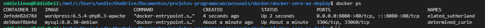

# WordPress com MySQL Utilizando Docker

Este repositório contém instruções detalhadas para configurar e executar uma aplicação WordPress com um banco de dados MySQL usando Docker e Docker Compose, com a finalidade de praticar e documentar processos.

## Introdução
Este projeto visa demonstrar como implementar e executar uma aplicação WordPress integrada com um banco de dados MySQL utilizando contêineres Docker. A configuração é feita de forma a garantir o isolamento dos componentes e a persistência dos dados.

## Pré-requisitos
Antes de iniciar, certifique-se de que você possui os seguintes softwares instalados no seu sistema:

- Docker: Utilizado para criar e gerenciar contêineres.
- Docker Compose: Ferramenta para orquestrar múltiplos contêineres.

## Diferença de containers vs máquinas virtuais (VMs)

A principal diferença entre containers Docker e máquinas virtuais (VMs). Ambos os métodos são utilizados para empacotar e executar aplicativos, mas o fazem de maneiras distintas.


#### Containers Docker:

- Leves: Os containers Docker são mais leves que as VMs, pois não emulam um sistema operacional completo. Em vez disso, eles compartilham o kernel do sistema operacional host e empacotam apenas os componentes específicos necessários para executar o aplicativo.
  Portáteis: A portabilidade é uma das principais vantagens dos containers Docker. Eles podem ser executados em qualquer ambiente que tenha o Docker Engine instalado, independentemente do sistema operacional subjacente.
- Isoláveis: Cada container Docker é executado em um ambiente isolado, o que significa que não interfere em outros containers ou no sistema operacional host. Isso torna os containers Docker ideais para ambientes multi-inquilino e para testar aplicativos em diferentes ambientes.
- Eficientes: Os containers Docker são mais eficientes que as VMs em termos de uso de recursos. Eles exigem menos CPU, memória e armazenamento, o que os torna ideais para ambientes com recursos limitados.

#### Máquinas Virtuais (VMs):

- Isolamento completo: As VMs fornecem um isolamento completo do sistema operacional, o que significa que cada VM tem seu próprio kernel, bibliotecas e aplicativos. Isso pode ser útil para executar aplicativos que exigem um ambiente específico ou para isolar aplicativos sensíveis.
- Flexibilidade: As VMs oferecem mais flexibilidade do que os containers Docker, pois podem ser configuradas com diferentes sistemas operacionais e softwares. Isso pode ser útil para executar aplicativos que não são compatíveis com o Docker ou para ambientes que exigem configurações específicas.
- Desempenho: As VMs geralmente têm melhor desempenho do que os containers Docker, pois possuem seus próprios recursos dedicados. Isso pode ser importante para aplicativos que exigem alto desempenho.

##### Qual tecnologia usar:

A melhor tecnologia para você dependerá de suas necessidades específicas. Se você precisa de uma solução leve, portátil e eficiente, os containers Docker são uma boa opção. Se você precisa de isolamento completo, flexibilidade ou melhor desempenho, as VMs podem ser uma opção melhor.

##### Foco na Imagem:

A imagem destaca os seguintes pontos importantes sobre o Docker:

- Os containers Docker são executados em um ambiente isolado, representado pelas caixas separadas na imagem.
- Os containers Docker compartilham o kernel do sistema operacional host, representado pela base comum na imagem.
- Os containers Docker são mais leves que as VMs, pois não emulam um sistema operacional completo.
- Os containers Docker são portáteis e podem ser executados em qualquer ambiente que tenha o Docker Engine instalado.

## OBJETIVO PRÁTICO - Guia de Implementação: WordPress e MySQL com Docker

Este documento tem como objetivo praticar e orientar sobre a implementação de uma aplicação WordPress utilizando MySQL, ambos rodando em contêineres Docker, garantindo isolamento, facilidade de configuração e manutenção.

1. Pré-requisitos
      Antes de começar, certifique-se de que você tem as seguintes ferramentas instaladas:
      - Docker: para criar e gerenciar contêineres.
      - Docker Compose: para orquestrar múltiplos contêineres.

### 2. Implementação com Docker

#### wordpress - php

Escolher versão da Imagem do wordpress
https://hub.docker.com/_/wordpress/tags

Executando container isolado possui seu próprio sistema de arquivos, sua própria rede e sua própria árvore de processos isolada, separada do host(isolado da minha maquina)

```
docker run [OPTIONS] IMAGE[:TAG|@DIGEST] [COMMAND] [ARG...]
```

Executando o Contêiner do WordPress

```
docker run wordpress:php8.3-fpm-alpine
```

Mostrar contêineres em execução e parados (-a, --all)

```
docker ps -a
```

##### Container - efemero: Efêmero é um termo de origem grega (em que "ephémeros" significa "apenas por um dia") usado para designar uma situação que dura muito pouco tempo.

Parar contêiner docker

```
docker stop my_container
```

Mapeamento de portas
Para realizar o mapeamento de portas basta saber qual porta será mapeada no host e qual deve receber essa conexão dentro do container.

- -p 8080:80 mapeia a porta 80 do container para a porta 8080 do host

```
docker run -p "<host>:<container>"
```

Não foi possivel acessar a porta com a versão "php8.3-fpm-alpine", alteramos para a versão "6.5.4-php8.3-apache"

```
docker run -p 8080:80 wordpress:6.5.4-php8.3-apache
```

Observações:

- -p 8080:80: Mapeia a porta 80 do contêiner para a porta 8080 do host.
- wordpress:6.5.4-php8.3-apache: Especifica a imagem e a versão a serem utilizadas

Possivel acessar conteiner http://localhost:8080/


Para informar os detalhes de conexão do banco de dados. Vamos rodar container do banco de dados em mysql para concluir a configuração do wordpress

##### Comando ps no Linux (visualiza processos)

Saber quais são os processos que mais consomem a CPU:

```linux
ps aux
```

Processos do container, rodando na minha maquina, reusando compartilhando os recursos do meu sistema operacional, mais leve do que a virtualização.


#### Banco de dados - mysql

Escolher versão da Imagem do mysql
https://hub.docker.com/_/mysql/tags

Referência da imagem é o nome e a versão da imagem mysql

```
docker run mysql:8.0.30-debian
```

O banco de dados não foi inicializado e a opção de senha não foi especificada
Você precisa especificar um dos seguintes:
-MYSQL_ROOT_PASSWORD
-MYSQL_ALLOW_EMPTY_PASSWORD
-MYSQL_RANDOM_ROOT_PASSWORD

Definir variavel de ambiente (-e)

```
docker run -e MYSQL_ROOT_PASSWORD=root mysql:8.0.30-debian
```

Mostrar container em execução

```
docker ps
```



O docker exec comando executa um novo comando em um contêiner em execução. Em seguida, execute um bash interativo no contêiner.

```
docker exec -it my_container bash
```

Acessando mysql dentro do container

```
mysql -uroot -proot
```


Criar uma base de dados para conextar com wordpress

```mysql
create database test;
```

Após informar os detalhes de conexão do banco de dados retorna error


##### O que aconteceu??

o local informado nos detalhes de conexão do banco de dados, se refere ao localhost do container onde esta rodando o wordpress, de forma isolada, onde mysql esta rodando em outro conteiner... sendo assim não é possivel conectar ao mysql

1. Solução: Identificar o ip do container

Docker inspecionar fornece informações detalhadas sobre construções controladas pelo Docker.

```
docker inspect mycontainer
```

Retorna IP do container que esta rodando na maquina.

```
"IPAddress": "172.17.0.2"
```

Colocar ip no campo "Servidor do banco de dados", porem não é uma boa pratica, após reiniciar o container o ip pode ser diferente

Por isso é melhor trabalhar com nome, os endereços na internet não são acessados por IP mas sim por nome e o DNS faz a conversão para o IP

2. Solução: DNS para comunicação entre containers(network)

#### Criar Rede Container (network)

Você pode criar redes personalizadas definidas pelo usuário e conectar vários contêineres à mesma rede. Uma vez conectados a uma rede definida pelo usuário, os contêineres podem se comunicar entre si usando endereços IP ou nomes de contêineres.


O exemplo a seguir cria uma rede:

```
docker network create wordpress-net
```

Executando contêiner do wordpress na rede criada(wordpress-net)

```
docker run -p 8080:80 --network wordpress-net wordpress:6.5.4-php8.3-apache
```

Executando contêiner do mysql na rede criada(wordpress-net) e definir nome para o container(--name mysqlwithdocker)

```
docker run --name mysqlwithdocker --network wordpress-net -e MYSQL_ROOT_PASSWORD=root mysql:8.0.30-debian
```

```
CONTAINER ID   IMAGE                           COMMAND                  CREATED          STATUS          PORTS                                   NAMES
e3ab7912a8f2   mysql:8.0.30-debian             "docker-entrypoint.s…"   22 seconds ago   Up 20 seconds   3306/tcp, 33060/tcp                     mysqlwithdocker
dc23e753a58c   wordpress:6.5.4-php8.3-apache   "docker-entrypoint.s…"   25 seconds ago   Up 24 seconds   0.0.0.0:8080->80/tcp, :::8080->80/tcp   wonderful_mccarthy
```

##### Container estão na mesma rede

Criar novo banco de dados e conectar ao wordpress


o nome do servidor do banco de dados pode ser justamente o nome do container do mysql (mysqlwithdocker), por estar na mesma rede ele pode ser acessivel pelo nome

```
CONTAINER ID   IMAGE                           COMMAND                  CREATED         STATUS         PORTS                                   NAMES
e3ab7912a8f2   mysql:8.0.30-debian             "docker-entrypoint.s…"   22 seconds ago   Up 20 seconds   3306/tcp, 33060/tcp                     mysqlwithdocker
dc23e753a58c   wordpress:6.5.4-php8.3-apache   "docker-entrypoint.s…"   25 seconds ago   Up 24 seconds   0.0.0.0:8080->80/tcp, :::8080->80/tcp   wonderful_mccarthy
```

Pronto foi possivel se conectar ao banco de dados


##### Como melhorar as execuções do conteiner, toda vez q reinicia perde os dados?

### Docker Compose

https://docs.docker.com/compose/

Docker Compose é uma ferramenta para definir e executar aplicativos com vários contêineres. É a chave para desbloquear uma experiência de desenvolvimento e implantação simplificada e eficiente.

Criar manifesto configuração inicial

```docker-compose.yaml
services:
  wordpress:
    image: wordpress:6.5.4-php8.3-apache
    ports:
      - 8080:80

  mysql:
    image: mysql:8.0.30-debian
    environment:
      - MYSQL_ROOT_PASSWORD=root
      - MYSQL_DATABASE=test
```

OBS: Não sera preciso criar a rede pois o docker compose cria uma rede padrão entre os containers

##### Executar os dois containers

```
docker compose up
```

Para informar os detalhes de conexão do banco de dados. nome do servidor do banco de dados é o proprio nome do container definido no docker-compose.yaml nomeado como (mysql)


```
NAME                                IMAGE                           COMMAND                  SERVICE     CREATED         STATUS                      PORTS
docker-zero-ao-deploy-mysql-1       mysql:8.0.30-debian             "docker-entrypoint.s…"   mysql       6 minutes ago   Exited (0) 34 seconds ago
docker-zero-ao-deploy-wordpress-1   wordpress:6.5.4-php8.3-apache   "docker-entrypoint.s…"   wordpress   6 minutes ago   Exited (0) 34 seconds ago
```

##### Matar containers

Interrompe contêineres e remove contêineres, redes, volumes e imagens criadas pelo up.

```
docker compose down
```

```
[+] Running 3/3
 ✔ Container docker-zero-ao-deploy-mysql-1      Removed                                                                                                                                                                0.0s
 ✔ Container docker-zero-ao-deploy-wordpress-1  Removed                                                                                                                                                                0.0s
 ✔ Network docker-zero-ao-deploy_default        Removed
```

PROBLEMA: Ao subir novamente os container todas as informações e banco de dados se perder(limpa) iniciando do zero

1. Solução: Volume
   volume ==== storage - compartilhado entre sua maquina e container

##### VOLUME - Melhorando a Persistência de Dados

Os volumes são o mecanismo preferido para persistir dados gerados e usados ​​por contêineres Docker. Embora as montagens de ligação dependam da estrutura de diretórios e do sistema operacional da máquina host, os volumes são totalmente gerenciados pelo Docker. Os volumes têm diversas vantagens sobre montagens vinculadas:

Incluir no manifesto  - volume (./mysql-data:/var/lib/mysql)

```docker-compose.yaml
services:
  wordpress:
    image: wordpress:6.5.4-php8.3-apache
    ports:
      - 8080:80

  mysql:
    image: mysql:8.0.30-debian
    environment:
      - MYSQL_ROOT_PASSWORD=root
      - MYSQL_DATABASE=test
    volumes:
      - ./mysql-data:/var/lib/mysql
```

Fazer configuração wordpress para verificar a mantebilidade dos dados

Mesmo após reiniciar os contêineres, os dados devem ser preservados devido ao uso de volumes.
```
docker compose down
```

Manteve os dados do mysql, porem o wordpress tambem precisa manter os dados

Incluir no manifesto - volume (./wordpress:/var/www/html)

```docker-compose.yaml
services:
  wordpress:
    image: wordpress:6.5.4-php8.3-apache
    ports:
      - 8080:80
    volumes:
      - ./wordpress:/var/www/html

  mysql:
    image: mysql:8.0.30-debian
    environment:
      - MYSQL_ROOT_PASSWORD=root
      - MYSQL_DATABASE=test
    volumes:
      - ./mysql-data:/var/lib/mysql

```

Os volumes garantem que, ao reiniciar os contêineres, os dados do WordPress e do MySQL sejam preservados


##### FERRAMENTA: Dev Containers

Os contêineres de desenvolvimento ou contêineres de des são contêineres do Docker configurados especificamente para fornecer um ambiente de desenvolvimento completo.

https://code.visualstudio.com/docs/devcontainers/containers

Dev Containers vai conectar o vscode no ambiente do container, como se fosse codar dentro do container

##### Conclusão

Através desse guia, foi realizado na pratica como implementar uma aplicação WordPress com MySQL utilizando Docker e Docker Compose. Isso inclui desde a escolha das imagens, execução e conexão dos contêineres até a persistência de dados e utilização de redes Docker para comunicação entre os contêineres. Para otimizar seu ambiente de desenvolvimento, considere o uso de Dev Containers.

Notas Finais:

- Certifique-se de manter suas imagens e contêineres atualizados.
- Utilize boas práticas de segurança ao configurar seus serviços e bancos de dados.
Para mais informações e suporte, consulte a documentação oficial do Docker e WordPress.

##### Referências
Docker Documentation(https://docs.docker.com/)
WordPress Docker Image (https://hub.docker.com/_/wordpress)
MySQL Docker Image (https://hub.docker.com/_/mysql)
